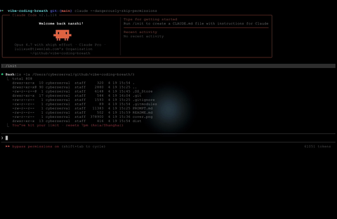

# Vibe Coding Breath

<!-- markdownlint-disable MD033 -->
<p align="center">
  <strong>English</strong> |
  <a href="README.zh-CN.md">简体中文</a>
</p>

<p align="center">
  
</p>
<!-- markdownlint-enable MD033 -->

**When AI works, you breathe.**

`VibeCodingBreath` is a menu-bar-only macOS breathing companion for the quiet space between prompt and result.
When the cursor rests, a centered breathing light guides inhale and exhale.
When you take the screen back, it disappears.

## How It Works

- Launch at login. Menu bar only. No Dock presence.
- One light. Inhale, exhale, repeat.
- Waiting becomes mindful time.

## Run

```bash
claude --dangerously-skip-permissions -p "$(cat PROMPT.md)"
```

## Repository

- Spec: `PROMPT.md`
- Prompt repo: [nanzhipro/vibe-coding-breath](https://github.com/nanzhipro/vibe-coding-breath)
- Generated app repo: [nanzhipro/VibeCodingBreath](https://github.com/nanzhipro/VibeCodingBreath)
