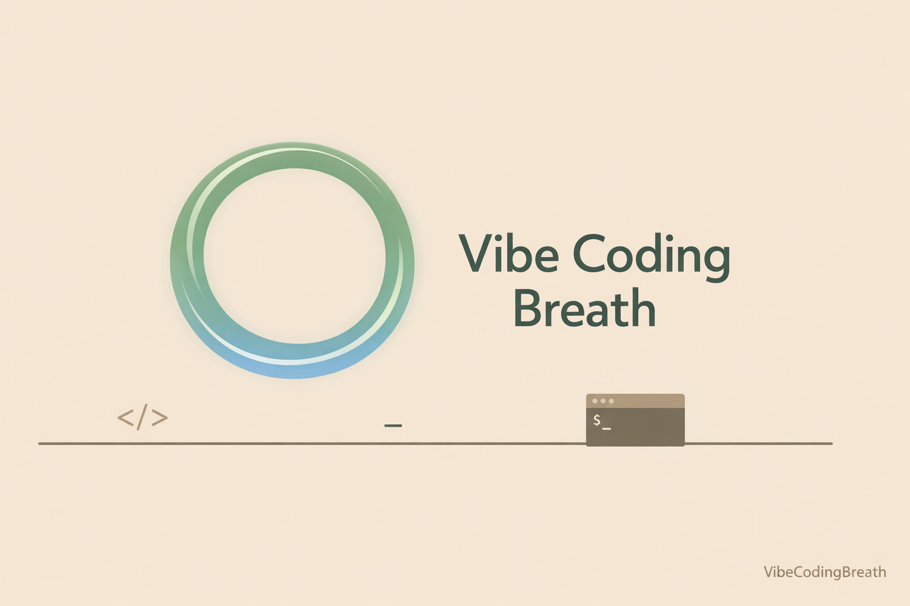

# Vibe Coding Breath

A minimal prompt-driven repo for generating `VibeCodingBreath`, a macOS menu-bar breathing companion app.

<p align="center">
  
</p>

## Files

- `PROMPT.md`: the one-shot app spec

## Run

```bash
claude --dangerously-skip-permissions -p "$(cat PROMPT.md)"
```

## Link

本仓库运行后，一步生成可运行 macOS App。

[nanzhipro/VibeCodingBreath](https://github.com/nanzhipro/VibeCodingBreath)
